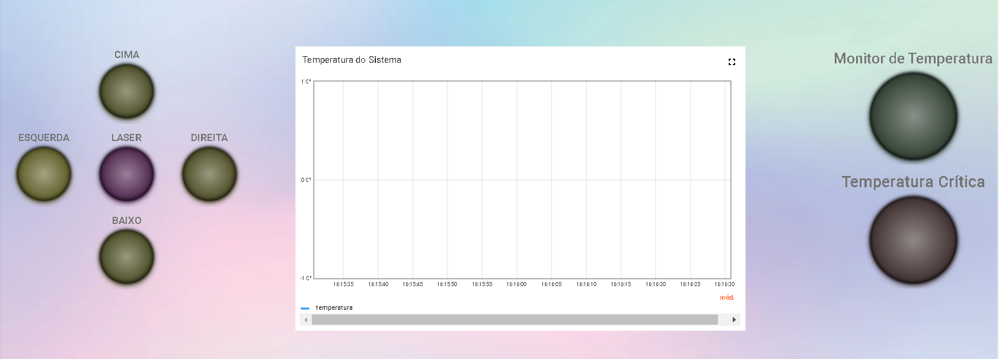

# Trabalho-Final-FSE 2022.2

## Alunos

| Nome | Matrícula  |
| :- | :- |
| Daniela Soares | 180015222 |
| Eduardo Maia Rezende  | 180119231 |
| Helder Lourenço de Abreu Marques | 180121847 |

### Descrição
 
Este projeto tem por objetivo simular uma máquina CNC, para corte e gravação em MDF, utilizando monitoramento remoto dos controles e temperatura do sistema via [ThingsBoard](https://thingsboard.io/).

## Módulos Utilizados & Guia de Utilização

#### Dispositivo 1 (ESP32-WROOM)
|  |   |
| :-: | :- |
| DHT11 | Temperatura |
| Passive Buzzer  | Alarme sonoro |

Para se utilizar o dispositivo 1 deve-se utilizar o código fonte implementado na branch "device1" deste repositório, realizar o build e upload, utilizando a extensão PlatformIO no VSCode, em uma ESP32-WROOM. Também é necessário configurar a rede wifi do dispositivo para seu correto funcionamento.

#### Dispositivo 2 (ESP32-WROOM)
|  |   |
| :-: | :- |
| Laser Module | Emissão de feixe de luz |
| KY-023 | Joystick |

Para se utilizar o dispositivo 2 deve-se utilizar o código fonte implementado na branch "device-2" deste repositório, realizar o build e upload, utilizando a extensão Espressif IDF no VSCode, em uma ESP32-WROOM. Também é necessário configurar a rede wifi do dispositivo para seu correto funcionamento.

